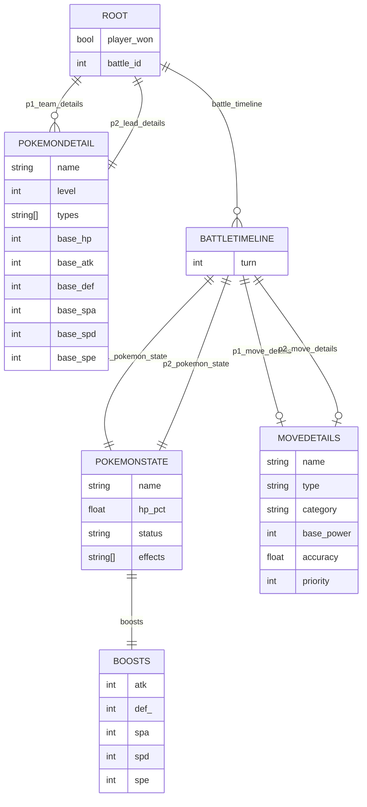

# FDS_Kaggle_Competition
A repo for the FDS kaggle competition on binary classifier for the Pokemon dataset

```bash
git clone https://github.com/longlive-pandas/FDS_Kaggle_Competition.git
```


### Utilizzare un personal access token o una chiave ssh per accedere su git (profile settings > dev settings > create a personal access token)

### Per eseguire lo script assicurarsi di avere un ambiente con uv (uv sinc) e eseguirlo da visual code per esempio come jupyter notebook (sotto la cartella notebook c'è il file main.ipynb)

### La lista delle dipendenze è nel file pyproject.toml


```toml 
dependencies = [ "ipykernel>=7.0.0", "ipywidgets>=8.1.7", "pandas>=2.3.3", "scikit-learn>=1.7.2", "tqdm>=4.67.1", ] 
``` 


### Uno schema dei dati di addestramento è mostrato nel file utils/schema.py


