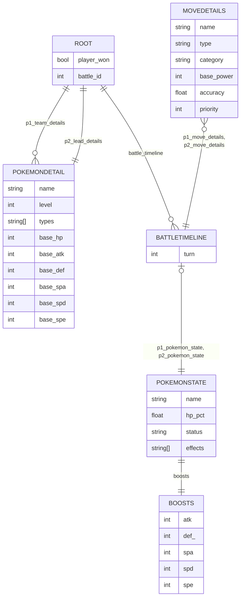

# FDS_Kaggle_Competition

A repository for the **FDS Kaggle competition**, focused on building a **binary classifier** for the Pokémon dataset.

Clone the repository with:

```bash
git clone https://github.com/longlive-pandas/FDS_Kaggle_Competition.git
```

---

## Accessing GitHub

If the repository is private, you must authenticate using either:

- a **Personal Access Token**  
  (GitHub → Profile → Settings → Developer Settings → Fine-grained Tokens)
- **SSH keys** configured on your machine

---

## Running the Code

This project uses **uv** for environment and dependency management.

To set up the environment:

```bash
uv sync
```

How to run it:

1. Open the root folder in **VS Code**
2. Run `final_consegna.py`

Alternatively you can run it on a terminal/bash window as `python final_consegna.py`

---

## Dependencies (from `pyproject.toml`)

```toml
dependencies = [
    "autofeat>=2.1.3",
    "ipykernel>=7.0.0",
    "ipywidgets>=8.1.7",
    "nbdime>=4.0.2",
    "pandas>=2.3.3",
    "pyarrow>=22.0.0",
    "scikit-learn>=1.7.2",
    "seaborn>=0.13.2",
    "tqdm>=4.67.1",
    "xgboost>=3.1.1",
]
```

---

## Training Data Schema

The structure of the training data is described in `utils/schema.py`.

Below is a Mermaid ER diagram representing the full dataset:




---
